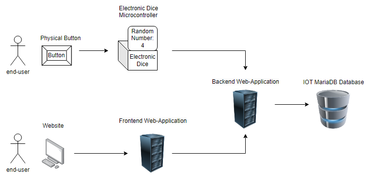

My first project where I have to make microprocessors and different hardware and software work together using the internet. The idea was conceived through design thinking where I had to design and sell a device. So I started looking for inspiration where it might help. I was able to learn a lot about different TI practices really enjoyed playing with different sensors and devices it was very informative for me.

First went to learn about arduino pins and connections high low includes syntax,
connection to the internet using sensors and various connections, and the basics of microprocessors and internet of things in general.

I borrowed and practiced with some sensors which gave me the confidence to get more parts. With 2 of the 5 sensors I ran into an issue where they can't really interface.

Actually the LCD just wouldn't work so I had obtained an i2c backpack which allowed me to interface but using diagnostic software it showed it couldn't find the LCD. So I lost a lot of time and the LCD is just broken. but still the LCD didn't give any light and burned out. so I had also ordered at the same time which made me order a new one and they do work which gave me a lot more insight into user interaction by displaying text messages on lcd.

I had never known so much about the world of microchips and development which broadened my development in engineering much more.


## System Requirements

**EMBRQ#01:** Embedded device sends measured sensordata to the application backend over http or https.

The sendData function sends a GET request to an API endpoint specified in the SERVER_URL variable, which includes the sensor data as query parameters. The request is made using the HTTPClient library and the begin, GET, and getString methods.

Code:
``` C++
  /* 
  * Sends an HTTP GET request with the rolled dice number to the API server.
  * 
  * @param number The thrown dice number to be sent in the request.
  * @return void
  */
  void sendData(int number) {

    HTTPClient http;  // Declare object of class HTTPClient
    WiFiClient client;
    
    // create api call, form the link with the data in the GET parameters
    String message = String(SERVER_URL) + "/api.php?action=create&number="+ number +"&chipid=" + chipID;
    if (DEBUG_MODE) Serial.println(message);

    http.begin(client, message); //Specify request destination
    int httpCode = http.GET(); // do request
    String payload = http.getString(); // Get the response payload

    if (httpCode > MINIMUM_CODE) { //Check for the returning code
      String payload = http.getString();
      if (DEBUG_MODE) {
        Serial.println(httpCode);
        Serial.println(payload);
      }
    }
    else {
      if (DEBUG_MODE) {
        Serial.println("Error on HTTP request");
        Serial.println(httpCode);
        Serial.println(payload);
      }
    }

    http.end();  //Close connection
  }
```

**EMBRQ#02:** Embedded device receives or retrieves status messages from the application backend over http or https.

In the display idle, screen i update the previous throws on the screen using a api call from the website backend, in which i used a parameter called read to request specific data using different link parameters.

Code:
``` C++
  /* 
  *  Display the result of a dice throw with ASCII art on the LCD screen
  *  
  *  @param number: the number thrown by the dice
  *  @return: void
  */
  void displayDice(int number) {

    lcd.setCursor(LEFT_LCD, TOP_LCD);
    lcd.print("________");
    
    lcd.setCursor(LEFT_LCD, TOP_LCD + 1);
    lcd.print("|      |  You Threw");
    
    lcd.setCursor(LEFT_LCD, TOP_LCD + 2);
    String diceNumber = String(number) + " ";

    if(number > DOUBLE_DIGITS) {
      diceNumber = String(number);
    }

    String diceText;

    switch(number) { // for offical dice between 1-6 show nice text
      case 1:
        diceText = "A One!";
        break;
      case 2:
        diceText = "A Two!";
        break;
      case 3:
        diceText = "A Three!";
        break;
      case 4:
        diceText = "A Four!";
        break;
      case 5:
        diceText = "A Five!";
        break;
      case 6:
        diceText = "A Six!";
        break;   
      default:
        diceText = "A " + String(number) + "!"; // else show the number
        break;   
    }  

    lcd.print("|  " + diceNumber + "  |  " + diceText);

    lcd.setCursor(LEFT_LCD, TOP_LCD + 3);
    lcd.print("|______|");
  }
```

**EMBRQ#03:** The embedded device contains at least two input sensors (e.g. LDR, buttons, joystick, capacitive touch, etc.).

The Electronic dice device uses 2 input sensors. One is a button to create a simple action to throw dice and let the computer do its thing. Where the second input sensor is a potentiometer. I probably could make a simple navigation menu, but i kept it simple and made the max throwable number match the input of the potentiometer.

Code:
``` C++
  /* 
  *  This function represents the default loop of the program, 
  *  it reads the analog data from the potentiometer, maps the value to the desired range, and sends a request to the server after a button press. 
  *  It also displays feedback on an LCD screen, showing the maximum number that can be rolled, the rolled number (when thrown), and idle screen with last thrown dice numbers.
  *  
  *  @param potentioMeter The current value read from the potentiometer.
  *  @return void
  */
  void loop() {

    // turn on led when ready
    digitalWrite(LED_PIN, HIGH);

    // check with delay agains stuttering
    delay(STUTTERING_DELAY); 
    
    // read values
    if (digitalRead(BUTTON_PIN) == LOW) buttonPressed = true; // when button pressed just wait for next cycle
    int potRead = analogRead (POTENTIOMETER_PIN); // read analog data
    int mappedVal = map(potRead, MIN_VALUE_POTENTIOMETER, MAX_VALUE_POTENTIOMETER, STARTING_DIGIT, MAX_NUM); // map the potentiometer value to the desired range
    //if (DEBUG_MODE) Serial.println(mappedVal);

    // update the potentiometer value in the idle screen
    lcd.setCursor(LEFT_LCD, TOP_LCD + 1);  
    lcd.print("Max Number: " + String(mappedVal));

    // get deltatime
    currentMillis = millis();

    if(buttonPressed == true) {

      if (DEBUG_MODE) Serial.println("Button Pressed!");

      //Every requestDelay, send a request to the server
      if (currentMillis > oldTime + REQUEST_DELAY) {

        if (DEBUG_MODE) Serial.println("Sending Event!");

        // turn off led to show its thinking
        digitalWrite(LED_PIN, LOW);
        
        // generate random number, using potentiometer
        int r = random(STARTING_DIGIT, mappedVal);
    
        // send data if connected
        if (WiFi.status() == WL_CONNECTED) {
          sendData(r);
        }
    
        // display feedback rolled number
        lcd.clear();
        displayDice(r);

        // wait 
        delay(DICE_THROW_DELAY); 

        // reset delay counter
        oldTime = currentMillis;
        buttonPressed = false;

        // update screen
        displayIdle(mappedVal);
      }
    }
  }
```

**EMBRQ#04:** The embedded device contains at least two visual and/or sensory outputs (e.g. LED, LED Matrix, 7-segement display, motor, servo, actuator, LCD-screen, etc.).

The Electronic dice device uses 2 sensory outputs to communicate with the end user. one of the sensors and most important one is the liquid crystal display (LCD). The LCD is used to show previous throws, the max throwable value and the dice throw reveal. The last one is pretty useful, its a simple light emitting diode (LED). This is used when the end-user can press the button again, this makes it intuitive to use when waiting for results and gives a little extra feedback.

Code:
``` C++
  /* 
  *  This function represents the default loop of the program, 
  *  it reads the analog data from the potentiometer, maps the value to the desired range, and sends a request to the server after a button press. 
  *  It also displays feedback on an LCD screen, showing the maximum number that can be rolled, the rolled number (when thrown), and idle screen with last thrown dice numbers.
  *  
  *  @param potentioMeter The current value read from the potentiometer.
  *  @return void
  */
  void loop() {

    // turn on led when ready
    digitalWrite(LED_PIN, HIGH);

    // check with delay agains stuttering
    delay(STUTTERING_DELAY); 
    
    // read values
    if (digitalRead(BUTTON_PIN) == LOW) buttonPressed = true; // when button pressed just wait for next cycle
    int potRead = analogRead (POTENTIOMETER_PIN); // read analog data
    int mappedVal = map(potRead, MIN_VALUE_POTENTIOMETER, MAX_VALUE_POTENTIOMETER, STARTING_DIGIT, MAX_NUM); // map the potentiometer value to the desired range
    //if (DEBUG_MODE) Serial.println(mappedVal);

    // update the potentiometer value in the idle screen
    lcd.setCursor(LEFT_LCD, TOP_LCD + 1);  
    lcd.print("Max Number: " + String(mappedVal));

    // get deltatime
    currentMillis = millis();

    if(buttonPressed == true) {

      if (DEBUG_MODE) Serial.println("Button Pressed!");

      //Every requestDelay, send a request to the server
      if (currentMillis > oldTime + REQUEST_DELAY) {

        if (DEBUG_MODE) Serial.println("Sending Event!");

        // turn off led to show its thinking
        digitalWrite(LED_PIN, LOW);
        
        // generate random number, using potentiometer
        int r = random(STARTING_DIGIT, mappedVal);
    
        // send data if connected
        if (WiFi.status() == WL_CONNECTED) {
          sendData(r);
        }
    
        // display feedback rolled number
        lcd.clear();
        displayDice(r);

        // wait 
        delay(DICE_THROW_DELAY); 

        // reset delay counter
        oldTime = currentMillis;
        buttonPressed = false;

        // update screen
        displayIdle(mappedVal);
      }
    }
  }
```

**EMBRQ#05:** 	
The embedded device uses the wifi manager for configuration of SSID, User ID (UID) en Password (PWD) for connecting to the network. 

The device uses a default connection system where the username and password can be pre-installed. But in case the user doesnt connect to any network, the user can simply connect to the device and choose a network by himself.

Code:
``` C++
  /*  
  *   This function is used to connect the device to the internet using the default WiFi network and password.
  *   It initiates the connection process. If the connection is not established within a certain time, it tries to reconnect.
  *   If the connection fails, it launches the WiFiManager to allow the user to manually connect and change the access points.
  *   
  *   @param BACKUP_SSID .
  *   @param BACKUP_PASSWORD .
  *   @return void (connection)
  */
  void connectToDefault() {
    WiFi.mode(WIFI_STA);
    WiFi.begin(BACKUP_SSID, BACKUP_PASSWORD);
    int timer = 0; // create a local scoped timer that starts at 0
    while (WiFi.status() != WL_CONNECTED && DEBUG_MODE) { // when not connected try reconeccting
      delay(DOT_DELAY);
      Serial.print(".");
      timer += DOT_DELAY;
      if (timer > RECONNECT_CANCEL_DELAY)
        break;
    }

    if (WiFi.status() == WL_CONNECTED) { // when connected show debugging information
      Serial.println("");
      Serial.println("WiFi connected");
      Serial.println("IP address: ");
      Serial.println(WiFi.localIP());
      Serial.println("WiFi Status: ");
      Serial.println(WiFi.status());
    }
    else { // if not connection
      // let the user be able to connect and change access points by himself
      WiFiManager wifiManager;
      wifiManager.autoConnect(CONFIG_SSID);
    }
  }
```


## Hardware overview

A schematic overview of the software components showing that the product exists and how they are connected
For local development reasons, we use localtunnel to redirect traffic to the local host.



## Circuit diagram

A schematic overview of the hardware components and how they are connected. Inexperienced students can use Fritzing, experienced users should draw schematics in an EDA of choice (EagleCAD, KiCAD, EasyEDA, etc.)


## BOM

A Bill of Materials (BOM) is a comprehensive list of all the raw materials, components, and sub-assemblies required to manufacture or build a product. It serves as a critical document that details the parts, quantities, and specifications needed for a production run, repair or maintenance project.

|BOMLevel|PartNumber|Manufacturer|PartName|Revision|Description|Quantity|Price|Exampleurl|
|--------|-------------|-----------------|--------------------|--------|-----------------------|--------|-----|-------------------------------------------------------------|
|2|hd44780|Hitachi|HD44780 20x2 LCD Blue||Liquid crystal display|1|€ 14.95|https://www.123-3d.nl/123-3D-LCD-20-x-4-blauw-wit-i226-t15363.html|
|0|ESP8266-CH340|EspressifSystems|WEMOS-D1-MINI|v4|controller for device|1|€ 6.35|https://opencircuit.nl/product/wemos-d1-mini-v4.0-wifi-module|
|1|PCF8574A|Hitachi|I2C LCD Backpack||Analog to I2C bus|1|€ 1.95|https://www.hobbyelectronica.nl/product/i2c-lcd-interface-voor-16x2-en-20x4-displays/|
|3|BL-10 RED||30MM Arcade button||Red arcade button|1|€ 0.61|https://uge-one.com/arcade-style-big-round-push-button-30mm-blue-color.html|
|4|||Powerbank 5v 2A||Any regular powerbank|1|€ 9.99|https://www.coolblue.nl/product/899025/bluebuilt-powerbank-20-000-mah-power-delivery-en-quick-charge.html|
|5|||USB to USB-C Cable||Any regular|1|€ 9.99|https://www.coolblue.nl/product/898237/veripart-usb-c-naar-usb-c-kabel-1m-kunststof-zwart.html|
|6|||5MM LED||Any regular (green)|1|€ 0.15|https://www.allekabels.nl/led-diode/7369/1074033/standaard-led-3mm-groen-diffuus.html|
|7|KW-1520||Potentiometer||Linear resistor 10K|1|€ 1.15|https://www.kiwi-electronics.com/nl/panel-mount-10k-potentiometer-breadboard-vriendelijk-1783?search=Panel%20Mount%2010K%20potentiometer|
|8|818520||Hout||Multiplex timmerplaat 3mm 122x61cm|1|€ 7.79|https://www.gamma.nl/assortiment/multiplex-timmerplaat-3-mm-122x61-cm/p/B818520|
