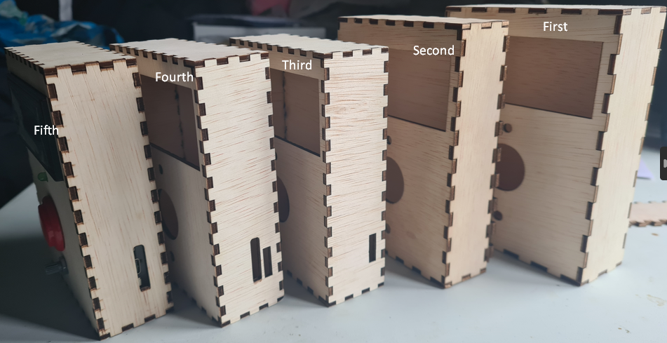

# Physical design

## Concept

The user is a boardgame player, someone in need of a number, gambler or someone who wants to try their luck. Its someone who uses dice regularly in some shape or form. Their needs is to have a random number while being entertained doing so. Their needs might also include keeping track of previous throws to verify cheaters, or even predicting what comes next.

That brings us to the main goal of the product which is to tackle those problems by making an electronic dice. Electronic dice can be helpful in this situation because they can keep track of numbers and be used to verify a throw in a specific moment in time. While not being constrained to physical reality, if you need a number from 1-6 and you have a 20 sided die you could not do anything about it. With Electronic Dice™ you can select the number ceiling and not requiring every dice ever.

**The requirements (SMART) defined for the product:**

1. Have a opening/Be able to interact with the LCD, Button, LED, Potentiometer and USB-C port.
2. Make it transportable in dimension between 20 by 20 centimeters.
3. It should be easy to manifacture by normal hobbyist level means.
4. It should protect the components.

**interaction/design sketch :**

I made different sketches of what the design and the interaction could be. Because you would look at the LCD while pressing the button, and when a higher number is needed the potentiometer could be turned to higher value. The user can look at the led and know as a indicator when he is able to press again. I made several choices about the shape of the final product. instead of working horizontal i want my design more vertical focussed like a gameboy as reference. I tought about the order of the buttons, but i went with the most familiar for me aligned in the middle as in order: LCD, LED, Button and potentiometer. And a simple hole to charge the device which could be expanded to hold a powerbank inside.

## Digital manufacturing materials and methods

I used [InkScape](https://inkscape.org/) and [MakersCase](https://www.makercase.com/#/basicbox) to give me a quickstart to making something of my own:

I want to use a lasercutter because it easy to quickly iterate on designs and because i am making a simple case which i would maybe want to decorate in the future i would want to use wood. I wanted to use 3D printer but realized it might not be perfect for this situation. I started to lean more towards lasercutting. After reading the HvA makerslab website i realized it might be the one solution for quickly prototyping a case for the device.

[HvA Makerslab lasercutter page](https://www.hva.nl/kc-fdmci/onderzoek/makerslab/makers-lab/lasersnijder/lasersnijder.html)

I chose lasercutting because it might be easier while prototyping to finish the wood by hand. This way i can iterate even quicker by cleaning and decorating the final case. I used the small bed lasercutter in HvA makerslab. While searching for woodtypes on the internet and looking at the suppliers that HVA provides on the website i saw a perfect prototyping wood.

[Gamma](https://www.gamma.nl/assortiment/multiplex-timmerplaat-3-mm-122x61-cm/p/B818520)

The properties of the multiplex wood fit the concept of an electronic dice well because it provides a sturdy base for the electronic components while also being lightweight, easy to transport and really thin. It also has a natural aesthetic that can be enhanced with laser engraving, making it a visually appealing material for the product. And also is pretty cheap which means that for prototyping purposes, it fit the bill perfectly. I also thought about using MDL wood which is like multiplex but lot softer, the choice went out the window because i wanted as thin as possible to conserve space and strong enough to avoid dents.

## Design

[MakersCase](https://www.makercase.com/#/basicbox) - base case design to expand on.

[InkScape](https://inkscape.org/) - to create the svg files to export and exporting to .dxf file to use in the lasercutter.
Paint - for quickly iterating/communicating idea's and sketches.

I drew variations of shapes and sizes to house the components. My first inspiration was to follow the design of a old school gameboy.
The thing i mostly was scared of was which order the buttons or sensors needs to be placed and what feels intuitive. I chose the design from the sketches before which what feel to me the most logical.

[v1 version (.svg)](files/box-v1.svg)

[v2 version (.svg)](files/box-v2.svg)

[v3 version (.svg)](files/box-v3.svg)

[v4 version (.dxf)](files/box-v4.dxf)

## Prototype

Make a simple case from wood, because lasercutting is fast and easy. Thats why i just started and iterate on the design cycle with minimal losses. I wanted to test if this was spacious enough to house all the components. And if it would protect and hold everything together. I used the smart requirements i defined before to test the criteria and this design seems to solve all of them.

The height was a bit too high to hold, i probably could adjust it but its more dependant on the components, at which the max height is 40mm. The width and depth could probably use more polishing. The width i kept almost 10mm padding from the LCD width. The depth was okay but i feel it needs more like a gameboy shape. In my failures i used examples to improve my prototyping and the overal design of the product.

## Create
I used [InkScape](https://inkscape.org/) to create a svg file and a base case. I measured everything using the caliper near the HVA makerslab lasercutter.

The lasercutter (BRM LASERCUTTER) has a computer, cutter and the air filtration system. Its about the size of a twin size bed. (Werkgebied 1600 x 1000 x 200 mm)

The multiplex wood is still a little warped. I had to cut the wood in to pieces at the store because otherwise it would be difficult to transport. And had to use the metal weights near the lasercutter to get an even and consistent cut.

**Manufacturing settings :**

1. Speed 25
2. Intensity 65
3. Origin is right bottom
4. Everything on one layer for cutting 
5. Everything on one layer for engraving (scanning)

Because this is relatively thin wood we could cut really fast without worring about uncut spots. We could play with intensity to get a faster results but may be more volatile/inconsistent.

This optimization was not really that game changing. The problem was that lasercutting is already fast. The trick is to measure twice and to cut once. I also added a proper usb-c port while cutting I did this by taking the already existing side plate and measured everything using a caliper and created a few sideplates with a hole, and added a ports on already cut sideplates.

|Status|Image|
|-|-|
|Uploading file to lasercutter using computer and USB stick|||
|Before lasercutting|||
|In-progress lasercutting|||
|After lasercutting|||

**Example (final) configuration/vector files:**

[v1 version (.svg)](files/box-v1.svg)

[v2 version (.svg)](files/box-v2.svg)

[v3 version (.svg)](files/box-v3.svg)

[v4 version (.dxf)](files/box-v4.dxf)

## Conclusion

**The final product and future improvements:**

**Pictures and or video show the final product in all angles and demonstrate the workings of the product**

|Angle|Image|
|-|-|
|TOP|||
|LEFT|||
|RIGHT|||
|BACK CLOSED|||
|BACK OPEN INSIDE|||
|BACK OPEN OUTISDE|||
|FRONT OFF|||
|FRONT IDLE|||
|FRONT THROW|||

### Requirements

All requirements have been reached because:

1. **Have a opening/Be able to interact with the LCD, Button, LED, Potentiometer and USB-C port.** 

    1. This criteria is reached because all the components have space to be interacted with.

2. **Make it transportable in dimension between 20 by 20 centimeters.** 

    1. The criteria is reached because its around the size of one phone tall and around one and half phones wide which makes it super easy and comfortable to transport, carry and use. 

3. **It should be easy to manifacture by normal hobbyist level means.** 

    1. This criteria was reached because you could probably make it with a woodsaw and have the same results. It was super easy to make and was a fun learning experience.

4. **It should protect the components.**

    1. This criteria was reached because the wood protects the components really wel, the adhesive on the breadbord sticks to the wood making it shakeproof. The inside can be filled in with padding material to make it not rattle and make it feel like it has quality and weight.

### Useability & improvements

The products is perfectly usable. Has a nice shape that conforms to my hand. Makes the device not fragile anymore and makes it fun to use to have people playtest. Probably could change the shape to not be that pointy and also make the insides more secure and holders for the components.
 
## Failures
**Learning is about trying and failing, describe your failures**

### !!! Failure 1
I wanted a easy to set-up creation for the end-user. The problem was after laser cutting i realised the proportions were too perfect/loose.

This way they did not lock together so the only  way the build could continue is to glue the parts together.

I tried glueing all the parts together. This made it hard to rework the internals and also made it look finnicky. Next time i would take more time in thinking or asking for advice trough the future problems that may arrive when designing a device or physical product.

### !!! Failure 2
I wanted to create a simple case to protect the internals of the device. But i realized my mistake after taking a day of to lasercut. When taking all the components into account i forgot to make a hole for the USB-C port (which is pretty important). So after the manufacturing process i realized i had no way for the power to access the device.

I tried solving it by taking a saw and lightly cut it removing as much material as possible without damaging the rest of the device. 
Then i took a file and started to file it to its final dimensions. Next time i need to take a better look when prototyping so i forgot the user process. Like for example charging or giving power to the device.

### !!! Failure 3
After creating the case i had problems fitting the components in.
LED doenst completely fit. Component spaces did not really fit except the button which was made to click inside the socket.

The first case was too big which made holding it uncomfortable, it wasnt really noticable but when held in hands its the corners that pinches you while holding it. 
Instead i decreased the depth, and height of the case. which gave it a bit of a gameboy form factor.

### !!! Failure 4
When putting together the "final" case for the device it was really hard to push them together without breaking the case. But because i did not know what kerf setting i needed to use i used the default value which was too tight. This caused Bursting seams, kerf wood breaking made it splinter along the edges which made it clear that the setting is too tight for my application.

I tried pushing it together sequentially spreading the pressure over as much of a area. Which worked but made me doubt if the next one assembled will have this problem too.
I should probably decrease the default kerf size by a tiny amount, because we use thin wood it makes it easy to break when under pressure.

<!-- **Each failure describes at least: what you wanted to achieve**

**what went wrong**
**(pictures and or screenshots)**
**how you tried to solve it**
**how you would approach the problem next time**

 -->

