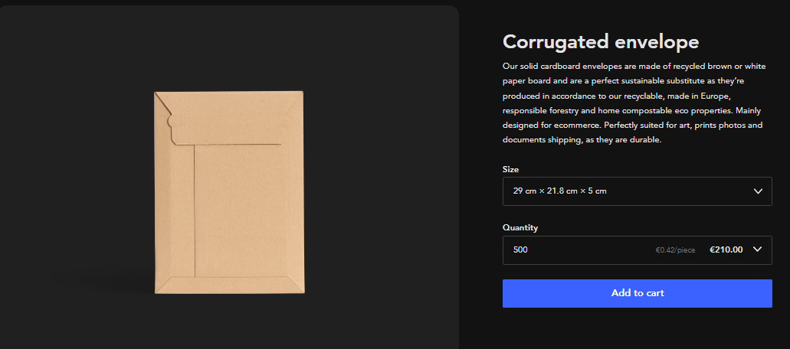

# Profile Fase: Business (Kickstarter)

## Introduction	
What if your blueprint becomes a real product? Inventing is just a small step in the overall process of bringing a product to market. Without actually improving the device itself, you can learn a lot by setting up a Kickstarter campaign where you learn about all the choices you have to make to actually make it work.

## Main question & sub questions	

**The main question of the research is:**

*"How to do a kickstarter and create a viable business after you have received the funds."*

**The possible sub-questions are:**

1. *"Who needs this product?"*
2. *"What is needed, how much does it all cost?"*
3. *"How to tie it all together into a executable plan, create a kickstarter and make a selfsustaining business"*

## Research Methods	

Deskresearch then fieldresearch

[Scribbr - Veldonderzoek](https://www.scribbr.nl/onderzoeksmethoden/fieldresearch-veldonderzoek/)

## Research results / analysis

### Who needs this product? (context)

**Business case**

There is often a shortage of different types of dice at game nights. Electronic dice can offer a wider range of options, including dice with different numbers of sides or custom designs that may not be available in physical dice.

For individuals with physical disabilities or limitations, electronic dice may be a more accessible option than traditional dice. They can be used with one hand or expanded on through voice commands, making them a more inclusive option for all players.

Electronic dice can be easily customized to fit the theme or style of a particular game night. This can add an extra level of immersion and engagement for players.

Keep track of your throws to remember what the last person threw, do verification and probability analyzing for the geeky fans.

**Target audience**

The user is a boardgame player, someone in need of a number, gambler or someone who wants to try their luck. Its someone who uses dice regularly in some shape or form. Their needs is to have a random number while being entertained doing so. Their needs might also include keeping track of previous throws to verify cheaters, or even predicting what comes next.

### Financial Costs

#### Parts costs

We have a list of the costs of the indivividual parts to be used in the end device.

|Index|PartNumber|Manufacturer|PartName|Revision|Description|Quantity|Price|Exampleurl|
|--------|-------------|-----------------|--------------------|--------|-----------------------|--------|-----|-------------------------------------------------------------|
|2|hd44780|Hitachi|HD44780 20x2 LCD Blue||Liquid crystal display|1|€ 14.95|[https://www.123-3d.nl/123-3D-LCD-20-x-4-blauw-wit-i226-t15363.html](https://www.123-3d.nl/123-3D-LCD-20-x-4-blauw-wit-i226-t15363.html)|
|0|ESP8266-CH340|EspressifSystems|WEMOS-D1-MINI|v4|controller for device|1|€ 6.35|[https://opencircuit.nl/product/wemos-d1-mini-v4.0-wifi-module](https://opencircuit.nl/product/wemos-d1-mini-v4.0-wifi-module)|
|1|PCF8574A|Hitachi|I2C LCD Backpack||Analog to I2C bus|1|€ 1.95|[https://www.hobbyelectronica.nl/product/i2c-lcd-interface-voor-16x2-en-20x4-displays/](https://www.hobbyelectronica.nl/product/i2c-lcd-interface-voor-16x2-en-20x4-displays/)|
|3|BL-10 RED||30MM Arcade button||Red arcade button|1|€ 0.61|[https://uge-one.com/arcade-style-big-round-push-button-30mm-blue-color.html](https://uge-one.com/arcade-style-big-round-push-button-30mm-blue-color.html)|
|4|||Powerbank 5v 2A||Any regular powerbank|(Optional)|€ 9.99|[https://www.coolblue.nl/product/899025/bluebuilt-powerbank-20-000-mah-power-delivery-en-quick-charge.html](https://www.coolblue.nl/product/899025/bluebuilt-powerbank-20-000-mah-power-delivery-en-quick-charge.html)|
|5|||USB to USB-C Cable||Any regular|(Optional)|€ 9.99|[https://www.coolblue.nl/product/898237/veripart-usb-c-naar-usb-c-kabel-1m-kunststof-zwart.html](https://www.coolblue.nl/product/898237/veripart-usb-c-naar-usb-c-kabel-1m-kunststof-zwart.html)|
|6|||5MM LED||Any regular (green)|1|€ 0.15|[https://www.allekabels.nl/led-diode/7369/1074033/standaard-led-3mm-groen-diffuus.html](https://www.allekabels.nl/led-diode/7369/1074033/standaard-led-3mm-groen-diffuus.html)|
|7|KW-1520||Potentiometer||Linear resistor 10K|1|€ 1.15|[https://www.kiwi-electronics.com/nl/panel-mount-10k-potentiometer-breadboard-vriendelijk-1783?search=Panel%20Mount%2010K%20potentiometer](https://www.kiwi-electronics.com/nl/panel-mount-10k-potentiometer-breadboard-vriendelijk-1783?search=Panel%20Mount%2010K%20potentiometer)|
|||||||Totaal|€ 25.16||

€ 25.16 for 1 parts kit. Optional items are not counted for, could be expanded in higher tiers. (could be up to € 45.16)

#### Lasercutting costs

There is a company that will cut wood with a lasercutter on request.

[www.snijlab.nl](https://snijlab.nl/)

for over 500 cases its € 11.97 per individual case, which together add up to € 5.895.00 (Also includes wood).

#### Packaging costs

[www.packhelp.com](https://packhelp.com/p/corrugated-envelope/plain/)

for over 500 packages it cost € 0.42 per individual packaging, which together costs about € 210.00

#### Shipping costs

[www.postnl.nl/zakelijke-tarieven](https://www.postnl.nl/zakelijke-tarieven/)

for over 250 packages it cost over € ~2.08 per individual package delivery, or 250 at one time for € ~520.50 (priority and ~2 day delivery).
The costs wildly differ from region, and time and circumstances.

[www.postnl.nl/tarievenboekje](https://www.postnl.nl/Images/def4-tarievenboekje-2023-zakelijk_tcm10-231776.pdf?version=8)

This pdfs specifies exactly what price it cost when it goes out the country. it mostly checks out with the calculation above but the cost float around from € 364.8 - to € 613.90 depending on priority and size.
The device can be cut and placed flat inside the envelope which makes it alot cheaper than conventional packages. This wil need a large margin of error logistics is the most important part of this project and must work preventive. 

#### Product Price calculation

Wholesale Price = (Cost of Materials + Labor Costs + shipping and packaging) / Units Produced

€ 44.19 = (12,730.95 + 8,320.00 + 1,262.50) / 505

<!-- 

Cost of Materials: This includes the cost of all materials required to produce the prototype, including any raw materials or components that need to be purchased. Be sure to include any shipping or handling costs associated with these materials.

Labor Costs: This includes the cost of any labor required to produce the prototype, including the wages of any employees involved in the production process. Be sure to factor in any benefits, such as payroll taxes or health insurance.

Overhead Expenses: This includes any indirect costs associated with producing the prototype, such as rent, utilities, insurance, or equipment maintenance. These costs should be divided by the number of units produced to determine the per-unit overhead expense.

Profit Margin: This is the amount of profit you want to make on each unit sold. This will vary depending on the product and market demand.

Units Produced: This is the number of units you plan to produce in a given period of time.

**retail pricing**

**profit margin**

**worldwide S&H costs including VAT and other taxes**

**Note that you should keep in mind that after shipping things can get lost in the mail. 10% of your rewards will NOT get delivered.** -->

#### Company cost calculation

**try to determine what you need to keep your company afloat in the long run**

[www.ondernemersplein.kvk.nl/inschrijven-bij-kvk](https://ondernemersplein.kvk.nl/inschrijven-bij-kvk/#:~:text=de%20afspraak%20inschrijft.-,De%20kosten%20voor%20inschrijving%20bij%20KVK,uw%20pinpas%20of%20creditcard%20betalen.)

eenmalig € 75.-

**employees** **job functions**

[www.werkzoeken.nl/salaris/inpakker/](https://www.werkzoeken.nl/salaris/inpakker/)

Packager : € 2.170 a month

**salaries**

1. (Me) CEO: € 5,600.00 a month

2. Packager: € 2,720.00 a month

3. Marketer: € 2,880.00 a month

**office space**

[www.flexas.com/huurprijzen](https://www.flexas.com/nl/blog/huurprijzen-kantoorruimte-waar-kun-je-op-rekenen#:~:text=Gemiddelde%20huurprijs%20van%20kantoor%20in%20Amsterdam%20per%20m2&text=De%20huurprijs%20ligt%20doorgaans%20tussen,euro%20per%20m%C2%B2%20per%20jaar.)

€ 30 a day no extra costs from below or € 900 a month for a shared office space.

**phone**

[www.kpn.com/zakelijk/internet-en-bellen](https://www.kpn.com/zakelijk/internet-en-bellen.htm)

€ 31,65 a month

**water**

[www.waternet.nl/zakelijk/drinkwater](https://www.waternet.nl/zakelijk/drinkwater-voor-bedrijven/kosten-met-watermeter/#:~:text=U%20betaalt%201%2C03%20euro,meer%20vaste%20kosten%20per%20jaar.)

€ 1,03 euro per m3 (1.000 liter).

€ 109,46 per jaar

**cleaning** 

[www.werkspot.nl/schoonmaak/prijzen](https://www.werkspot.nl/schoonmaak/prijzen-kosten/eenmalige-schoonmaak-woonhuis-bedrijfspand)

€ 18 * 2 hours = € 36.

€ 36 * 4 week = € 144 a month (if we need it).

**electrical**

[www.vattenfall.nl/stroom/kwh-kosten](https://www.vattenfall.nl/stroom/kwh-kosten/#:~:text=Stel%201%20kWh%20kost%20%E2%82%AC%200%2C40%20(prijsplafond%202023).)

€ 0,40 per kWh voor de eerste 2.900 kWh stroom

**heating**

[www.vattenfall.nl/nieuws/prijsplafond](https://www.vattenfall.nl/nieuws/prijsplafond/)

€ 1.45 per m³ voor de eerste 1.200 m³ gas

€ 47.38 per GJ voor de eerste 37 GJ warmte

<!-- **security**

**insurance etc** -->

## Implementation

The kickstarter shows a movie clip where the product is showcased, all the details are on the page itself.

[Kickstarter page Electronic Dice](https://www.kickstarter.com/projects/electronicdice/1208339871?ref=1hhsrb&token=2dd73436)

The costs we calculated before are put into the spreadsheet of kickstarter to automatically generate a pie chart of the costs on the kickstarter page.

## Conclusion & recommendations

The kickstarter and the plan we created might be able to become self sustainable after intial launch.

Try to minimize the cost of the product and the production of it, to have a higher profit margin its easier and more tempting to opt in as a contributer when the product is a lower price and promises more. In the long run it wil be easier to optimize and work on polishing the company workflow.

## References

M. (z.d.). Wat is de gemiddelde huurprijs per m2 voor een bedrijfspand? Flexas.com. [https://www.flexas.com/nl/blog/huurprijzen-kantoorruimte-waar-kun-je-op-rekenen](https://www.flexas.com/nl/blog/huurprijzen-kantoorruimte-waar-kun-je-op-rekenen)

Ondernemersplein. (2023b). Inschrijven bij KVK: dit moet u weten. ondernemersplein.kvk.nl. [https://ondernemersplein.kvk.nl/inschrijven-bij-kvk/](https://ondernemersplein.kvk.nl/inschrijven-bij-kvk/)

Snijlab. (z.d.). [https://snijlab.nl/](https://snijlab.nl/)

Jensen, L., & Özkil, A. G. (2018). Identifying challenges in crowdfunded product development: a review of Kickstarter projects. Design science, 4. [https://doi.org/10.1017/dsj.2018.14](https://doi.org/10.1017/dsj.2018.14)

Benders, L. (2021, 12 november). Veldonderzoek (fieldresearch) doen voor je scriptie. Scribbr. [https://www.scribbr.nl/onderzoeksmethoden/fieldresearch-veldonderzoek/](https://www.scribbr.nl/onderzoeksmethoden/fieldresearch-veldonderzoek/)

Packhelp. (2023, 30 maart). Corrugated envelope - plain | Packhelp. [(https://packhelp.com/p/corrugated-envelope/plain/)](https://packhelp.com/p/corrugated-envelope/plain/)
