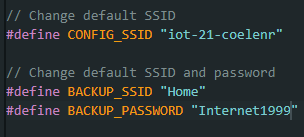

# User Manual

## Product description

## Step-by-step guide

**INTRODUCTION An introduction to your product, start by giving context about the problem you are solving for your target audience and include a product description, product images, and  product features (a list of things your product can do).**

You want to have more flair when playing board games with family or friends?
Why not use electronic dice? With electronic dice you can keep the statistics or remember what you threw last time. This way you wont forget what the odds are leaning too. You can use it to settle arguments of what happend before with the throw history.

The Dice itself will be a microcontroller with a button, LCD screen to display the thrown number and a battery to make it wireless and easy to carry it around. 

There will be a website where you can throw dice, see history, and or even statistics to keep you up to date on the changes the dice lives through. There will be an admin page to see and manage all the data, and a sweet user friendly front-end where you can see the statics, device data, and the history of throws.

To enable the electronic dice to work everywhere, we took the time to create an API where the microcontroller can talk to the website and keep track of your physical gaming statistics.

**INSTALLATION INSTRUCTIONS ARDUINO IDE AND LIBRARIES**

Download and install the following libraries:

Download the arduino IDE software to install and flashing the microcontroller

Installation instructions on how to install the development environment for your product (Arduino IDE, Web development IDE, libraries used, ...). 

**BUILD INSTRUCTIONS EMBEDDED DEVICE Elaborate step-by-step build instructions on how to physically build (e.g. connect wires, solder etc.) the  prototype embedded device.**

Solder led with the resistor at the low-end (cathode) and connect it up as in the diagram
Solder 3 wires to the potentiometer for easy use

**INSTALLATION INSTRUCTIONS EMBEDDED CODE Elaborate step-by-step installation instructions on how to get the software of your embedded device from your Gitlab-repository and installing this on your embedded device.**

**NETWORK CONFIGURATION OF EMBEDDED DEVICE Elaborate step-by-step instructions on how to configure the Wifi network of your embedded device.**

**USAGE OF EMBEDDED DEVICE Elaborate step-by-step instructions on how to use the embedded device as an end user.**

INSTALLATION INSTRUCTIONS DOCKER DESKTOP
Elaborate step-by-step installation instructions on how to install Docker Desktop on your laptop/MacBook/host machine.

https://www.docker.com/

INSTALLATION INSTRUCTIONS APPLICATION CODE AND LIBRARIES/FRAMEWORKS
Elaborate installation instructions on how to download and install code from your GitLab repository and libraries or frameworks used from internet,

CONFIGURATION OF THE DATABASE
Elaborate instructions on how to configure the database using PhpMyAdmin or other database management tool.

USAGE OF APPLICATION FRONT END
Elaborate step-by-step instructions on how to use the front-end as an end-user and/or admin.

API-REFERENCE
API-reference documentation of your self built Web Application back-end API.

[Link to API documentation](api_documentation.md)

|Step|Image|Description|
|-|-|-|
|1|||
|2|||
|3|||
|4|||
|5|||