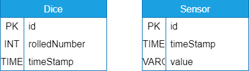
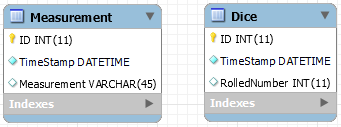
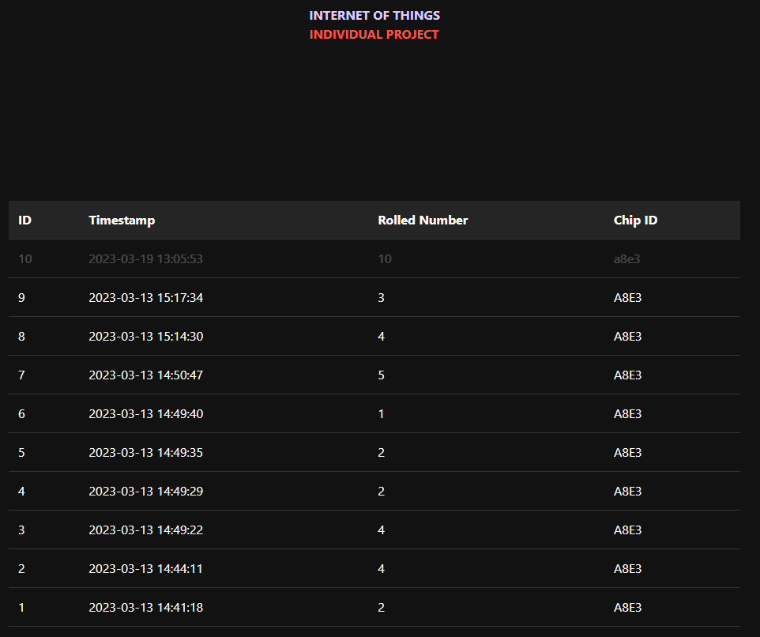

## Creating Database & Entity Relationship Diagram

Creating a database is an important step in organizing and managing data for any organization or project. A database is a collection of data that is organized and stored in a way that allows for efficient retrieval and manipulation of the information.

The database schema includes the structure of the database, including the tables, columns, and relationships between tables. The entity-relationship diagram (ERD) is a tool used to visualize the schema and the relationships between entities. Here is my Entity Relationship Diagram I designed in the beginning which was a tought process over what data should i save and need later?





Once the design was close enough, the database can be implemented using a database management system (DBMS). The DBMS provides a way to create, modify, and query the database. Which was in this case MySQL Workbench. I recreated the ERD I have created and during the development and designing of the database i added corrections:



Here we create the schema which is the database, and holds all tables and values.

```sql
CREATE SCHEMA IF NOT EXISTS `IOT` DEFAULT CHARACTER SET utf8mb4 ;
USE `IOT` ;
```

Then we create the Dice table which has auto incrementing ID and automatically added timeStamp() function, and the number we are saving and the chipid from the device. We can use the chipid later to filter, it will be the same for the timestamp.

```sql
CREATE TABLE IF NOT EXISTS `IOT`.`Dice` (
  `ID` INT(11) NOT NULL AUTO_INCREMENT,
  `TimeStamp` DATETIME NOT NULL DEFAULT CURRENT_TIMESTAMP(),
  `RolledNumber` INT(11) NULL DEFAULT NULL,
  `ChipID` VARCHAR(45) NULL DEFAULT NULL,
  PRIMARY KEY (`ID`))
ENGINE = InnoDB
AUTO_INCREMENT = 10
DEFAULT CHARACTER SET = utf8mb4;
```

I added a Measurement table with values id, timestamp, and measurement. This was to save any sensor value which might come up later in development, The table is used to save potentiometer data so we can filter with max throws so we always get dice throws that are below 6.

```sql
CREATE TABLE IF NOT EXISTS `IOT`.`Measurement` (
  `ID` INT(11) NOT NULL AUTO_INCREMENT,
  `TimeStamp` DATETIME NOT NULL DEFAULT CURRENT_TIMESTAMP(),
  `Measurement` VARCHAR(45) NULL DEFAULT NULL,
  PRIMARY KEY (`ID`))
ENGINE = InnoDB
DEFAULT CHARACTER SET = utf8mb4;
```

I added Dice has Measurement as last because its a many:many table relationship but it might not be the case. so multiple dice can have multiple values. (which might be incorrect). But its mostly used to indicate what sensor the dice throw is based off.

``` sql
CREATE TABLE IF NOT EXISTS `IOT`.`Dice_has_Measurement` (
  `Dice_ID` INT(11) NOT NULL,
  `Measurement_ID` INT(11) NOT NULL,
  PRIMARY KEY (`Dice_ID`, `Measurement_ID`),
  INDEX `fk_Dice_has_Measurement_Measurement1_idx` (`Measurement_ID` ASC) VISIBLE,
  INDEX `fk_Dice_has_Measurement_Dice_idx` (`Dice_ID` ASC) VISIBLE,
  CONSTRAINT `fk_Dice_has_Measurement_Dice`
    FOREIGN KEY (`Dice_ID`)
    REFERENCES `IOT`.`Dice` (`ID`)
    ON DELETE NO ACTION
    ON UPDATE NO ACTION,
  CONSTRAINT `fk_Dice_has_Measurement_Measurement1`
    FOREIGN KEY (`Measurement_ID`)
    REFERENCES `IOT`.`Measurement` (`ID`)
    ON DELETE NO ACTION
    ON UPDATE NO ACTION)
ENGINE = InnoDB
DEFAULT CHARACTER SET = utf8mb4;
```

After tweaking and realising the system and testing i ended with the following ERD diagram made in workbench. ChipID and a many to many relationship was added to the ERD as corrections.


### Download link for the Database:

[Database file (.sql)](files/database-backup.sql)

To install the .sql file onto the database: 

#### phpmyadmin
1. type in the web-browser address bar "localhost/phpmyadmin/".
2. Login with given credentials
3. When logged in, click on "importing" at the top bar.
4. Upload the .sql file, change settings to your liking (doesnt need any change).
5. Press import!
6. You see a screen filled with successfull commands, go to the database and always double check if everything is properly imported.
7. Done!

#### mysql workbench

1. Start up mysql workbench and connect to the database.
2. In the upperleft corner there is a "sql file with a folder" icon, click on it.
3. Select and import the downloaded .sql file.
4. You should see a screen with the imported sql commands.
5. In the left upper second bar, you should see a lighting icon, click on it.
6. The sql commands are being executed at the bottom, with no errors.
7. Done!

## Making the link between back-end and database

The back-end of my website is the middleman between the user and the data that is stored on the server we can call it a facade. It usually handles the data handling, sanitization and logic.

### Database connection

First a connection to the database is set-up, which could be expanded to have more error handling. Then it set-ups the different facades using the connection from the set-up before. We can later use the initialized facade in different data function that will handle requests. Because im used to having a Model View Controller system, the connection part would normally be the Model in MVC system.

[Github Database Connection File](https://gitlab.fdmci.hva.nl/IoT/2022-2023-feb-jun/individual-project/iot-coelenr/-/blob/a14b7e9e85667fde064cf9b5716d897ba44a71c5/docker/web/database.php)

``` php
    // Database connection details
    $servername = 'mariadb';
    $user = 'root';
    $password = '7YKyE8R2AhKzswfN';
    $dbname = 'IOT';

    // Connect to the database
    $conn = mysqli_connect($servername, $user, $password, $dbname);

    // Check for connection errors
    if (!$conn) {
        die('Connection failed: ' . mysqli_connect_error());
    }

    // Create an instance of the DiceFacade class/model/database
    require "diceFacade.php";
    $dice_facade = new DiceFacade($conn);
```

### Facade

The DiceFacade is the middle man between the database and the front-end (Facade). The DiceFacade handles all data using the Create Read Update Delete (CRUD) pattern. It only has functions for now that are crucial for the working of the general whole system. When the facade is initialized the constructor takes the connection and saves it for local use. The create function takes 2 variables, chipid and rollednumber. Which is neccesary to save device data. Next is the read function with this function all data can be read, and i added a minified version (API) for the device to not crash the microcontroller. The sanitization of data here could be very much improved upon.


[Github DiceFacade Backend File](https://gitlab.fdmci.hva.nl/IoT/2022-2023-feb-jun/individual-project/iot-coelenr/-/blob/a14b7e9e85667fde064cf9b5716d897ba44a71c5/docker/web/diceFacade.php)

``` php
/*
* Programmed by: Rico Coelen
*
* This script provides a simplified way to store and retrieve using the CRUD design system
* to retrieve/save dice roll information in a database table called "dice".
* This script acts as a layer, a facade. to seperate the functions and increase the reusability for the developer.
*
* MIT License
* Copyright (c) 2023 Rico Coelen
*/

class DiceFacade {
  
  private $conn;
  
  function __construct($conn) {
    $this->conn = $conn;
  }
  
  function create($rollednumber, $chipid) {
    $timestamp = date('Y-m-d H:i:s');

    $sql = "INSERT INTO dice (ID, TimeStamp, RolledNumber, ChipID) VALUES (NULL, NULLIF('$timestamp', ''), '$rollednumber', '$chipid')";
    if ($this->conn->query($sql) === TRUE) {
      return true;
    } else {
      return false;
    }
  }

  function read($chipID = null, $limit = 5) {
    $sql = "SELECT * FROM dice";
    
    if ($chipID !== null) {
      $sql .= " WHERE chipid = '" . $chipID . "'";
    }

    $sql .= " ORDER BY TimeStamp DESC";
    
    if ($limit !== null) {
      $sql .= " LIMIT " . $limit;
    }
    
    $result = $this->conn->query($sql);
    
    if ($result->num_rows > 0) {
      $rows = array();
      while ($row = $result->fetch_assoc()) {
        $rows[] = $row;
      }
      return $rows;
    } else {
      return false;
    }
  }
}
```

## Making the Application Programming Interface

The API should be a seperate module from the front-end and back-end. The API module handles the request from the website and or the microncontroller using a switch state to determine what action to follow up on (which could be improved). The request includes create function which just sanitizes/validate and saves the record/data to database.

[Github API file](https://gitlab.fdmci.hva.nl/IoT/2022-2023-feb-jun/individual-project/iot-coelenr/-/blob/a14b7e9e85667fde064cf9b5716d897ba44a71c5/docker/web/api.php)

``` php
    /*
    * Programmed by: Rico Coelen
    *
    * This script provides a simplified way to store and retrieve using the CRUD design system
    * to retrieve/save dice roll information in a database table called "dice".
    * This script catches API request and fetches the request using the facades.
    *
    * MIT License
    * Copyright (c) 2023 Rico Coelen
    */

    // Set the response headers
    header('Content-Type: application/json');

    // get $conn
    require "database.php";

    switch($_GET["action"]) {
        case "create":
            // Create a new record in the dice table
            $dice_facade->create($_GET["number"], $_GET["chipid"]);
            echo json_encode(array('success' => true)); // relay success variable to device
            break;

        case "read":

            // check optional variables here
            $limit = isset($_GET["limit"]) ? $_GET["limit"] : null;
            $chipid = isset($_GET["chipid"]) ? strtoupper($_GET["chipid"]) : null;

            // handle extra parameters
            if (isset($_GET["textready"])) { // check if arduino is requesting data to show (minified version for arduino ram)
                $temp = ($dice_facade->read($chipid, $limit));
                $numbers = array();
                if($temp) {
                    foreach ($temp as $arr) {
                        array_push($numbers, $arr["RolledNumber"]);
                    }
                }
                array_push($numbers, array('success' => true)); // add success message
                echo json_encode($numbers); // relay information to device
            }
            else {
                $data = ($dice_facade->read($chipid, $limit)); // read data using facade
                array_push($data, array('success' => true)); // add success message
                echo json_encode($data); // relay information to device
            }

            break;
        default:
            echo json_encode(array('success' => true)); // even when nothing returns show connection established
            echo "No Action!";
            break;
    }
```

## Making the Frontend

The front-end is a really simplistic view of the data, now there are no function to filter or manipulate data for now but that could be subject to change. The index page has a simple table that updates every N seconds. When it has new data it will flash the new data at the top.

[Github HTML FILE LINK](https://gitlab.fdmci.hva.nl/IoT/2022-2023-feb-jun/individual-project/iot-coelenr/-/blob/a14b7e9e85667fde064cf9b5716d897ba44a71c5/docker/web/index.php)

[Github JS FILE LINK](https://gitlab.fdmci.hva.nl/IoT/2022-2023-feb-jun/individual-project/iot-coelenr/-/blob/a14b7e9e85667fde064cf9b5716d897ba44a71c5/docker/web/static/js/data.js)

[Github CSS FILE LINK](https://gitlab.fdmci.hva.nl/IoT/2022-2023-feb-jun/individual-project/iot-coelenr/-/blob/a14b7e9e85667fde064cf9b5716d897ba44a71c5/docker/web/static/css/style.css)

[Jquery](https://jquery.com/)

### Screenshot

Screenshot of the index.php page where you can see live data.


Screenshot of the flashing data using CSS.



### Code/Ajax Calls

To not get weird logic we want to save previous data to later compare against new data.

``` Javascript
var existingData;
``` 

The get data function is the function that get runned in the first frame which does the initial creation of the table and does a AJAX call towards the backend of the website and uses the read function to get all data from the Dice table. And does not care if the data already existed or not.

``` Javascript
function getData() {
    $.ajax({
        url: "api.php?action=read", // URL of backend API
        dataType: "json",
        success: function(data) {
            console.log("Started Data!"); 
            // Call the `updateData` function to start fetching data from the server
            existingData = data;
            UpdateDiceTable(data);
            setTimeout(updateData, 2000);
        },
        error: function(xhr, status, error) {
            console.log(error); // handle the error here
        },
    });
}
``` 

The UpdateFunction get run every N seconds and compares new data with old and update and animate the table with new data.

``` javascript 
function updateData() {
    $.ajax({
        url: "api.php?action=read", // URL of backend API
        dataType: "json",
        success: function(data) {
            // Check if the new data is different from the existing data
            if (JSON.stringify(existingData) !== JSON.stringify(data)) {
                UpdateDiceTable(data);
                existingData = data;
            }
        },
        error: function(xhr, status, error) {
            console.log(error); // handle the error here
        },
        complete: function() {
            // repeat function every 2 seconds
            setTimeout(updateData, 2000);
            console.log("Updated Data!"); 
        }
    });
}
```
This function does the actuall appending of the data towards the html table, it also sorts it by ID so we can see the newest rolled number at the top.

``` javascript 
function UpdateDiceTable(data) {

    // Sort data by ID in descending order
    data.sort(function(a, b) {
        return b.ID - a.ID;
    });

    // Clear the table body
    $("#data-container").empty();

    // Add the new data to the table
    $.each(data, function(i, item) {
        var row = $("<tr>");
        $("<td>").html(item.ID).appendTo(row);
        $("<td>").html(item.TimeStamp).appendTo(row);
        $("<td>").html(item.RolledNumber).appendTo(row);
        $("<td>").html(item.ChipID).appendTo(row);
        if (i == 0) {
            row.addClass("flash");
        }
        row.appendTo("#data-container");
    });
}
```

When the javascript code is fully loaded in we can run getData() to start the updating process which will repeat indefinitely.

``` javascript 
getData();

```
